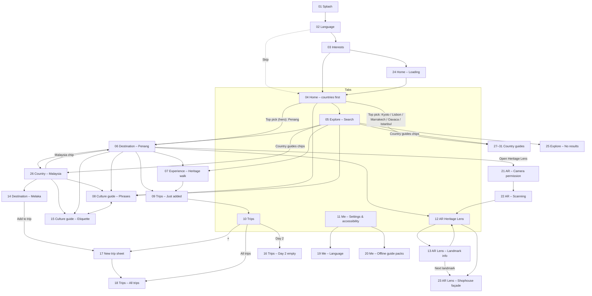

# Information architecture

The site map of the Tourix mobile prototype as it exists in Figma (page **Mobile Prototype (iOS)**). Every screen listed here is a real frame unless it's marked **Proposed** or **Planned**.

Related: [user-flows](user-flows.md) · [prototype-interactions](prototype-interactions.md)

> The brief requires a **site map + IA** deliverable that the prototype must *tally* with (5 marks). Use this page as the starting point for that artefact, but validate the groupings with **card sorting** (Part 3, Define) before submitting. Card sorting is **Planned**.

## 0. Hierarchy (worldwide scope, approved 5 Oct 2026)

Tourix is a worldwide app, so content is organised **country first**:

```
World (Home: 3D Top picks in the hero; Explore → Country guides)
└── Country            26 Malaysia · 27 Japan · 28 Morocco · 29 Portugal · 30 Mexico · 31 Türkiye
    ├── Destination    06 Penang, 14 Melaka, 32–50 (every destination card opens a page)
    │   ├── Experiences tab  51 Penang, 52 Melaka
    │   ├── Experience 07 Heritage walk, 53 Hawker breakfast, 54 Batu Caves
    │   └── AR Heritage Lens (12, 13, 21–23)
    └── Culture guide  08 Phrases, 15 Etiquette, 55 Festivals
```

Trips, Me and Explore sit outside this tree: a trip can mix stops from any destination, and search covers every level.

## 1. Site map

**74 screens** in 7 flow sections with 9 flow starts (v5, 7 Oct 2026). 01–31 are **Verified**. Most of the 43 v5 screens were walked through in presentation mode on 7 Oct 2026; the ones marked *Built* in §2 were not. Penang and Melaka live on 26; 27–31 are reached from Home's Top picks and Explore's Country guides chips; every destination card on 26–31 opens its page (06, 14, 32–50).



### v5 additions (7 Oct 2026)

```mermaid
graph TD
  C26[26 Malaysia] --> D1[32–35 KL · Langkawi · Cameron Highlands · Sabah]
  C27[27–31 Country guides] --> D2[36–50 three destinations per country]
  D1 -- KL highlight --> BATU[54 Batu Caves]
  P[06 Penang] -- Experiences --> PE[51 Penang · Experiences] --> HB[53 Hawker breakfast]
  P --> HB
  M[14 Melaka] -- Experiences --> ME[52 Melaka · Experiences]
  CG[08 Phrases / 15 Etiquette] -- Festivals --> FE[55 Festivals]
  H[04 Home] -- bell --> N[61 Notifications]
  H -- location chip --> LOC[62 Location sheet]
  H -- Batu card --> BATU
  E[05 Explore] -- chips --> F[63 Places · 64 Experiences · 65 Food · 66 Phrases]
  T[09/10 Trips] -- Share plan --> SH[58 Share sheet]
  T -- Undo --> UN[59 Removed] -- Redo --> T
  ALL[18 All trips] -- Melaka trip --> MT[57 Melaka day trip]
  NT[17 New trip] -- Invite --> INV[60 Invite sheet]
  MEP[11 Me] --> SV[56 Saved]
  MEP --> SY[67 Synced devices]
  MEP --> UNI[68 Units]
  MEP --> AB[69 About]
  LANG[19 Language] --> BM[74 Home in Bahasa Melayu]
  LENS[12 AR Lens] <--> PH[70 Phrases mode]
  LENS <--> FD[71 Food nearby mode]
  LENS -- Kopitiam label --> KO[72 Kopitiam sheet]
  OFF[73 Home – Offline] -- Open offline packs --> PK[20 Offline packs]
```



## 2. Screen inventory

| # | Frame (exact Figma name) | Section | Level | Entry points | Status |
|---|---|---|---|---|---|
| 01 | `01 Splash` | Flow 1 · First launch | Launch | Flow start "1 · First launch" | Verified |
| 02 | `02 Onboarding – Language` | Flow 1 | Onboarding | Splash (auto) | Verified |
| 03 | `03 Onboarding – Interests` | Flow 1 | Onboarding | Continue on 02 | Verified |
| 04 | `04 Home` | Flow 2 · Discover a destination | Tab (world level) | Onboarding, Home tab, flow start "2 · Returning user (Home)" | Verified (countries-first since 5 Oct 2026) |
| 05 | `05 Explore – Search` | Flow 2 | Tab | Explore tab, Home search, mood tiles, See all, Add a stop | Verified |
| 06 | `06 Destination – Penang` | Flow 2 | Detail (destination) | Penang card (26; was Home), Penang result (Search) | Verified |
| 07 | `07 Experience – Heritage walk` | Flow 2 | Detail (experience) | Experience card (06), result (05) | Verified |
| 08 | `08 Culture guide – Phrases` | Flow 2 | Detail (has tab bar) | Phrase card (04), Phrases result (05), Phrases tab (15), Culture guide (26) | Verified |
| 09 | `09 Trips – Just added` | Flow 3 · Plan a trip & settings | Transitional | Add to trip (06), Add to Day 1 (07) | Verified |
| 10 | `10 Trips` | Flow 3 | Tab | Trips tab, auto from 09 | Verified |
| 11 | `11 Me – Settings & accessibility` | Flow 3 | Tab | Me tab | Verified |
| 12 | `12 AR Heritage Lens` | Flow 4 · AR Heritage Lens | Tab / full-screen | Lens tab, auto from 22, sheet close (13, 23) | Verified |
| 13 | `13 AR Lens – Landmark info` | Flow 4 | Sheet state | Five-foot way label (12), Next landmark (23) | Verified |
| 14 | `14 Destination – Melaka` | Flow 2 | Detail (destination) | Melaka card (26; was Home), Melaka chip (25), flow start "4 · Plan a day trip (Melaka)" | Verified (v2) |
| 15 | `15 Culture guide – Etiquette` | Flow 2 | Detail (has tab bar) | Etiquette tab (06, 08, 14), Etiquette (26) | Verified (v2) |
| 16 | `16 Trips – Day 2 (empty)` | Flow 3 | Tab state | Day 2 chip (09, 10) | Verified (v2) |
| 17 | `17 Trips – New trip (sheet)` | Flow 3 | Sheet | Add to trip (14), New trip + (09, 10, 16, 18) | Verified (v2) |
| 18 | `18 Trips – All trips` | Flow 3 | Tab level up | Create trip (17), All trips (09, 10) | Verified (v2) |
| 19 | `19 Me – Language` | Flow 3 | Detail | Language row (11) | Verified (v2) |
| 20 | `20 Me – Offline guide packs` | Flow 3 | Detail | Offline guide packs row (11) | Verified (v2) |
| 21 | `21 AR – Camera permission` | Flow 4 | Full-screen | Open Heritage Lens (06), flow start "3 · AR Heritage Lens" | Verified (v2) |
| 22 | `22 AR – Scanning` | Flow 4 | Full-screen state | Allow camera (21) | Verified (v2) |
| 23 | `23 AR Lens – Shophouse façade` | Flow 4 | Sheet state | Façade label (12), Next landmark (13) | Verified (v2) |
| 24 | `24 Home – Loading` | Flow 5 · States & edge cases | State | Start exploring (03), flow start "5 · States & edge cases" | Verified (v2) |
| 25 | `25 Explore – No results` | Flow 5 | State | Tapping the search field on 05 (simulated typo) | Verified (v2) |
| 26 | `26 Country – Malaysia` | Flow 2 | Detail (country, has tab bar) | Explore chip (05), Malaysia breadcrumb (06, 14) | Verified (5 Oct 2026) |
| 27 | `27 Country – Japan` | Flow 6 · Country guides | Detail (country) | Kyoto pick (04), Explore chip (05), flow start "6 · Country guides" | Verified (5 Oct 2026) |
| 28 | `28 Country – Morocco` | Flow 6 | Detail (country) | Marrakech pick (04), Explore chip (05) | Verified (5 Oct 2026) |
| 29 | `29 Country – Portugal` | Flow 6 | Detail (country) | Lisbon pick (04), Explore chip (05) | Verified (5 Oct 2026) |
| 30 | `30 Country – Mexico` | Flow 6 | Detail (country) | Oaxaca pick (04), Explore chip (05) | Verified (5 Oct 2026) |
| 31 | `31 Country – Türkiye` | Flow 6 | Detail (country) | Istanbul pick (04), Explore chip (05) | Verified (5 Oct 2026) |
| 32 | `32 Destination – Kuala Lumpur` | Flow 7 · Destinations | Detail (destination) | Kuala Lumpur card (26), flow start "7 · Destinations" | Verified (7 Oct 2026) |
| 33 | `33 Destination – Langkawi` | Flow 7 · Destinations | Detail (destination) | Langkawi card (26) | Built (7 Oct 2026); same template as 32 |
| 34 | `34 Destination – Cameron Highlands` | Flow 7 · Destinations | Detail (destination) | Cameron Highlands card (26) | Built (7 Oct 2026); same template as 32 |
| 35 | `35 Destination – Sabah` | Flow 7 · Destinations | Detail (destination) | Sabah card (26) | Built (7 Oct 2026); same template as 32 |
| 36 | `36 Destination – Kyoto` | Flow 7 · Destinations | Detail (destination) | Kyoto card (27) | Built (7 Oct 2026); same template as 32 |
| 37 | `37 Destination – Tokyo` | Flow 7 · Destinations | Detail (destination) | Tokyo card (27) | Built (7 Oct 2026); same template as 32 |
| 38 | `38 Destination – Hokkaido` | Flow 7 · Destinations | Detail (destination) | Hokkaido card (27) | Built (7 Oct 2026); same template as 32 |
| 39 | `39 Destination – Marrakech` | Flow 7 · Destinations | Detail (destination) | Marrakech card (28) | Built (7 Oct 2026); same template as 32 |
| 40 | `40 Destination – Fes` | Flow 7 · Destinations | Detail (destination) | Fes card (28) | Built (7 Oct 2026); same template as 32 |
| 41 | `41 Destination – Chefchaouen` | Flow 7 · Destinations | Detail (destination) | Chefchaouen card (28) | Built (7 Oct 2026); same template as 32 |
| 42 | `42 Destination – Lisbon` | Flow 7 · Destinations | Detail (destination) | Lisbon card (29) | Built (7 Oct 2026); same template as 32 |
| 43 | `43 Destination – Porto` | Flow 7 · Destinations | Detail (destination) | Porto card (29) | Built (7 Oct 2026); same template as 32 |
| 44 | `44 Destination – The Algarve` | Flow 7 · Destinations | Detail (destination) | The Algarve card (29) | Built (7 Oct 2026); same template as 32 |
| 45 | `45 Destination – Oaxaca` | Flow 7 · Destinations | Detail (destination) | Oaxaca card (30) | Built (7 Oct 2026); same template as 32 |
| 46 | `46 Destination – Mexico City` | Flow 7 · Destinations | Detail (destination) | Mexico City card (30) | Built (7 Oct 2026); same template as 32 |
| 47 | `47 Destination – Yucatán` | Flow 7 · Destinations | Detail (destination) | Yucatán card (30) | Built (7 Oct 2026); same template as 32 |
| 48 | `48 Destination – Istanbul` | Flow 7 · Destinations | Detail (destination) | Istanbul card (31) | Built (7 Oct 2026); same template as 32 |
| 49 | `49 Destination – Cappadocia` | Flow 7 · Destinations | Detail (destination) | Cappadocia card (31) | Built (7 Oct 2026); same template as 32 |
| 50 | `50 Destination – Antalya` | Flow 7 · Destinations | Detail (destination) | Antalya card (31) | Built (7 Oct 2026); same template as 32 |
| 51 | `51 Destination – Penang · Experiences` | Flow 2 | Detail (destination tab) | Experiences segment (06) | Verified (7 Oct 2026) |
| 52 | `52 Destination – Melaka · Experiences` | Flow 2 | Detail (destination tab) | Experiences segment and experience cards (14) | Verified (7 Oct 2026) |
| 53 | `53 Experience – Hawker breakfast` | Flow 2 | Detail (experience) | Hawker breakfast card (06), result (05), row (51) | Verified (7 Oct 2026) |
| 54 | `54 Experience – Batu Caves` | Flow 2 | Detail (experience) | Batu Caves card (04, 73, 74), KL highlight (32) | Verified (7 Oct 2026) |
| 55 | `55 Culture guide – Festivals` | Flow 2 | Detail (has tab bar) | Festivals segment (08, 15) | Verified (7 Oct 2026) |
| 56 | `56 Me – Saved` | Flow 3 | Detail | Profile card (11) | Verified (7 Oct 2026) |
| 57 | `57 Trips – Melaka day trip` | Flow 3 | Detail (trip) | Melaka trip card (18) | Built (7 Oct 2026); not yet walked through |
| 58 | `58 Trips – Share plan (sheet)` | Flow 3 | Sheet | Share plan (09, 10, 59), Share (57) | Verified (7 Oct 2026) |
| 59 | `59 Trips – Removed (undo)` | Flow 3 | State | Undo on the 09 toast | Built (7 Oct 2026); not yet walked through |
| 60 | `60 Trips – Invite a friend (sheet)` | Flow 3 | Sheet | Invite (17), toast Invite (18), 57 | Built (7 Oct 2026); not yet walked through |
| 61 | `61 Home – Notifications` | Flow 2 | Detail | Bell (04, 73, 74) | Verified (7 Oct 2026) |
| 62 | `62 Home – Location (sheet)` | Flow 2 | Sheet | Location chip (04, 73, 74) | Verified (7 Oct 2026) |
| 63 | `63 Explore – Places` | Flow 2 | Filter state | Places chip (05, 64–66) | Verified (7 Oct 2026) |
| 64 | `64 Explore – Experiences` | Flow 2 | Filter state | Experiences chip (05, 63, 65, 66) | Verified (7 Oct 2026) |
| 65 | `65 Explore – Food` | Flow 2 | Filter state | Food chip (05, 63, 64, 66) | Built (7 Oct 2026); not yet walked through |
| 66 | `66 Explore – Phrases` | Flow 2 | Filter state | Phrases chip (05, 63–65) | Built (7 Oct 2026); not yet walked through |
| 67 | `67 Me – Synced devices` | Flow 3 | Detail | Synced devices row (11) | Built (7 Oct 2026); not yet walked through |
| 68 | `68 Me – Units` | Flow 3 | Detail | Units row (11) | Built (7 Oct 2026); not yet walked through |
| 69 | `69 Me – About Tourix` | Flow 3 | Detail | About row (11) | Built (7 Oct 2026); not yet walked through |
| 70 | `70 AR Lens – Phrases` | Flow 4 | Full-screen mode | Phrases mode (12, 71) | Verified (7 Oct 2026) |
| 71 | `71 AR Lens – Food nearby` | Flow 4 | Full-screen mode | Food nearby mode (12, 70) | Verified (7 Oct 2026) |
| 72 | `72 AR Lens – Kopitiam` | Flow 4 | Sheet state | Kopitiam label (12) | Verified (7 Oct 2026) |
| 73 | `73 Home – Offline` | Flow 5 | State | Flow start "8 · Offline mode" | Verified (7 Oct 2026) |
| 74 | `74 Home – Bahasa Melayu` | Flow 5 | State (language) | "Preview Tourix in Bahasa Melayu" (19), flow start "9 · Bahasa Melayu" | Verified (7 Oct 2026) |

## 3. Primary navigation

| Tab | Screen | Purpose |
|---|---|---|
| Home | 04 | World level: 3D Top picks, moods, phrase of the day, nearby |
| Explore | 05 | Search and filter places, experiences, food, phrases (searching by country is **Proposed**) |
| Lens (raised) | 12 | AR heritage layer (the advanced feature) |
| Trips | 10 | Day-by-day plans, synced across devices |
| Me | 11 | Language, accessibility, offline, sync, about |

## 4. Content groupings

| Group | Content objects | Where |
|---|---|---|
| Countries | Malaysia (full); Japan, Morocco, Portugal, Mexico, Türkiye (country guides) | Home Top picks, Explore chips; 26–31 |
| Places | 6 destinations in Malaysia, 3 in each other country (21 in total) | 26–31 carousels; detail pages 06, 14, 32–50 |
| Experiences | Heritage walk, Hawker breakfast, Batu Caves (full pages); more as rows on 51/52 and as destination highlights | 07, 53, 54; 51, 52; Home, Search, 64 |
| Moods / interests | Nature & adventure, Cultural heritage, Food & local cuisine, Beaches & islands, City exploration (+ Festivals & events, Hidden gems, Travelling with family in onboarding) | 03, 04 |
| Culture | Phrases, etiquette, dress-code tips, local terms (Malay for Malaysia) | 04, 06, 07, 08, 13, 15, 23, 26 |
| Plans | Trips list → Trip → Day → Stop (time, title, note), map; travel companions; share and undo | 09, 10, 16, 17, 18, 57–60 |
| Settings | Saved, Language & region, Accessibility, Offline & sync, Units, About | 11, 19, 20, 56, 67–69 |
| Alerts and context | Notifications, location, offline state | 61, 62, 73 |

## 5. Gaps (not designed)

Closed by v5 (7 Oct 2026): destination pages outside Malaysia (36–50), the four unlinked Malaysian destinations (32–35), the Experiences and Festivals tabs (51, 52, 55), Share plan, Undo, Units, Synced devices and About (58, 59, 67–69), and the Melaka trip detail (57).

| Area | Note | Status |
|---|---|---|
| Experiences outside Malaysia | Highlights on 36–50 are information rows, not pages | Proposed |
| Switching country from inside a country | Only via Back, or the breadcrumb on destination pages | **Proposed:** a country chip in the Country page header |
| Sign-in / account | Not present (the user is a "Guest explorer"); 67 says "sign in with the same account" | Unverified whether needed |
| Map / nearby explorer | Only the static trip map and the AR Food nearby mode (71) | Proposed |
| Second screen size | Only 393 × 852 exists | Planned (brief) |
