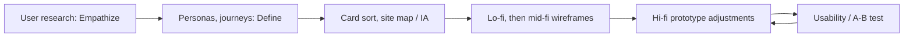

# Roadmap

Where the Tourix prototype stands and what to do next, ordered by impact on the Part 2 marks and on the core journeys. There are no deadlines here except the brief's own: Part 1 in Week 4 (week of 5 Oct 2026), Parts 2 and 3 in Week 14. Nothing below is approved work unless the team says so.

Related: [requirements](requirements.md) · [changelog](changelog.md)

## Completed (Verified, 4 Oct 2026)

- [x] Design system: 30 variables (Tourix Tokens), 15 text styles, 4 effect styles.
- [x] Components:
  - Logo, Button (8 variants), Filter Chip, Save Button, Toggle, Search Field
  - 16 icons
  - Destination, Experience and Showcase cards; Category Tile; Benefit Item
  - **3D Showcase** (6 states)
  - Status Bar, Tab Bar, Interest Tile
- [x] 13 linked iOS screens in 4 flows, with 3 flow starting points; device iPhone 16.
- [x] **v2:** 12 more screens (25 total) in 5 flows with 5 starting points: Melaka, Etiquette, Day 2 empty, New trip, All trips, Language, Offline packs, AR permission, AR scanning, second landmark, Home loading, no results.
- [x] **v2:** Language Picker and Phrase Card components; 3D Showcase pause/play; `line-strong` token, focus ring, 44 pt targets, solid status bars; stale JUST ADDED badge removed.
- [x] Advanced feature: AR Heritage Lens + landmark sheet.
- [x] Brand name Tourix applied: text, layer names, descriptions, file name, variable collection.
- [x] Documentation set (this folder).
- [x] **Worldwide scope** (5 Oct 2026): countries-first Home, `26 Country – Malaysia`, carousel moved to 26, country-neutral copy, file renamed, Read me board, docs. Malaysia is the fully built country.
- [x] **v5** (7 Oct 2026): every remaining page designed: 43 screens (32–74) — 19 destination pages (Flow 7), Penang/Melaka Experiences tabs, Hawker breakfast, Batu Caves, Festivals, Saved, Melaka trip, Share/Invite sheets, Undo, Notifications, Location, Explore filters, Synced devices, Units, About, AR Phrases/Food nearby modes, Kopitiam sheet, Offline and Bahasa Melayu Home; flow starts 7–9; fixes v5.1–v5.8.
- [x] **v4** (5 Oct 2026): one 3D carousel on Home — Top picks moved into the hero with the showcase's glow, orbit and fireflies; showcase and duplicate section removed from Home.
- [x] **v3** (5 Oct 2026): country guides 27–31 (Flow 6), 3D Top recommendations, Explore country chips, Malaysia breadcrumbs, motion layer (Ken Burns, reveal, press, heart pop, AR pulse, shimmer), greeting/title fixes, retired brand name removed everywhere.

## In progress

| Item | Gap |
|---|---|
| Walkthrough | 57, 59, 60 (after the scrim fix), 65–69 and 33–50 were built but not walked through in presentation mode |
| Search | One fixed query; filter results are fixed samples |
| Settings | Toggles don't demonstrate their effect (Reduce motion, High contrast) |
| Add to trip | The new destination pages open the Melaka-prefilled sheet (17) |
| Content checks | Travel facts on 32–50, AR distances on 71 and the BM copy on 74 are Unverified |

## Identified improvements, prioritised

| P | Improvement | Why | Effort |
|---|---|---|---|
| **P0** | Produce the **site map/IA, task flows, lo-fi and mid-fi wireframes** that the prototype must tally with | Required deliverables; 5 marks depend on the tally | Team |
| **P0** | Write the **iOS justification** from survey data | Brief requirement | Team |
| ~~P1~~ | ~~Empty, loading and permission states~~ Done in v2 (16, 21, 22, 24, 25); offline banner done in v5 (73) | "Edge cases work perfectly" is in the A+ band | S |
| ~~P1~~ | ~~Non-text contrast: `line-strong` token, focus ring~~ Done in v2 | WCAG 2.1 AA 1.4.11 | — |
| **P1** | ~~Pause control~~ done in v2. **Remaining:** link the Reduce-motion toggle to the paused showcase | WCAG 2.2.2 | S |
| ~~P1~~ | ~~Selectable language options~~ done in v2; BM Home done in v5 (74). **Remaining:** native-speaker check | Demonstrates the multilingual design consideration | M |
| ~~P1~~ | ~~Status-bar overlap on 06 and 07~~ Done in v2 | Visual polish | — |
| **P2** | Componentise the repeated patterns (Icon Button, List Row, Settings Row, Segmented Control, Toast, AR Label, Mood Card) | Consistency, faster iteration | M |
| **P2** | Replace Hover variants with **Pressed** variants for mobile | Correct touch feedback | M |
| ~~P2~~ | ~~Link the remaining destination cards~~ Done in v5 (32–50) | Avoid dead taps in testing | — |
| **P2** | One "Add to trip" sheet per destination instead of the Melaka-prefilled 17 | Correct content in testing | S |
| **P2** | Bind the mobile radii to the radius tokens | Token consistency | S |
| **P2** | Annotate the VoiceOver labels and reading order | Accessibility evidence | S |
| **P3** | Second screen size (iPhone SE / Pro Max) for Home and Penang | "Consider different screen sizes" | M |
| ~~P3~~ | ~~Remove the "JUST ADDED" badge on `10 Trips`~~ Done in v2 | Consistency | — |

## Future enhancements (Proposed, not requirements)

- Experience pages for destinations outside Malaysia (36–50 list highlights as rows).
- Static variants of Home and the country pages for the Reduce-motion setting.

- **A second built country** (Country page, 2 destinations, culture guide) to prove the pattern scales.
- A country chip on the Country page header to switch country without going back to Home.
- Search by country in Explore.

- Premium micro-interactions P1–P9 in [design §6](design.md#proposed-premium-polish-not-built-needs-approval).
- Bahasa Melayu content pass; Arabic/RTL exploration if research supports it.
- A nearby map explorer.
- A data-saver mode beyond the Wi-Fi-only download toggle on 20.

## Dependencies

Research has to come first. Changes to the hi-fi prototype should follow the IA and wireframes, so the final submission tallies.
