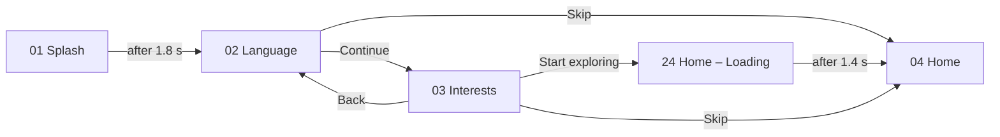
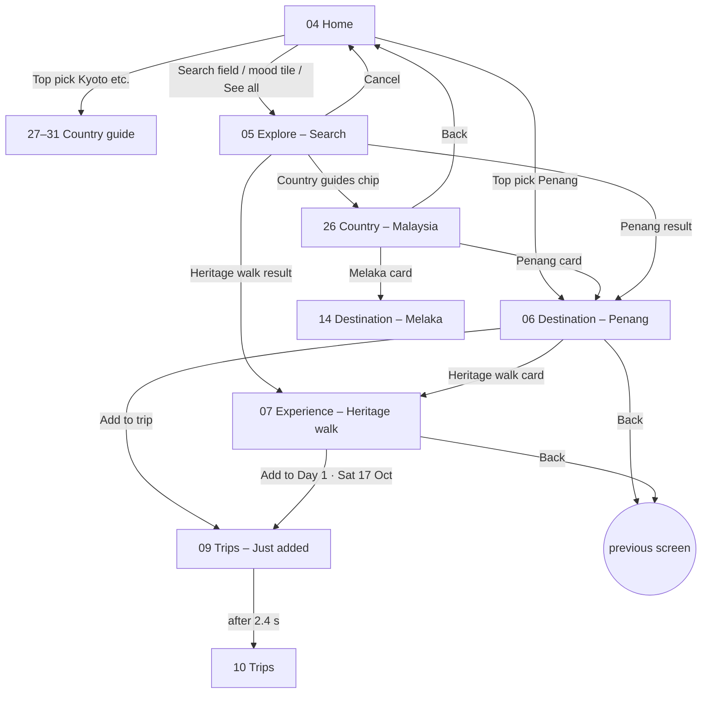
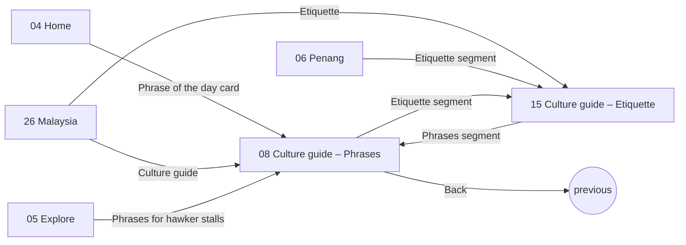
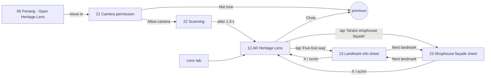
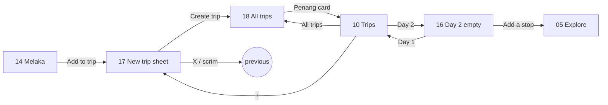

# User flows

The journeys the prototype actually supports, traced from its prototype connections (inventory export, 4 Oct 2026) and checked in presentation mode on 3–4 Oct 2026. Frame names are exact. The worldwide-scope changes were built and re-tested in presentation mode on 5 Oct 2026 (flows 1 and 2, Malaysia → Penang / Phrases / Etiquette).

Related: [information-architecture](information-architecture.md) · [prototype-interactions](prototype-interactions.md)

> The brief asks for **task-flow diagrams with decision points**. The flowcharts below are a starting point. Redraw them in FigJam or your diagram tool for the report, and tie them to your personas once they exist.

## Flow starting points (Verified)

| Name in Figma | Starts at |
|---|---|
| 1 · First launch | `01 Splash` |
| 2 · Returning user (Home) | `04 Home` |
| 3 · AR Heritage Lens | `21 AR – Camera permission` (v2; was `12`) |
| 4 · Plan a day trip (Melaka) | `14 Destination – Melaka` (v2) |
| 5 · States & edge cases | `24 Home – Loading` (v2) |
| 6 · Country guides | `27 Country – Japan` (v3) |
| 7 · Destinations | `32 Destination – Kuala Lumpur` (v5) |
| 8 · Offline mode | `73 Home – Offline` (v5) |
| 9 · Bahasa Melayu | `74 Home – Bahasa Melayu` (v5) |

---

## F1 · First launch (onboarding)

**Goal:** set the language and interests, then reach useful content. **Start:** `01 Splash`. Onboarding stays country-neutral: the user picks a country on Home, not here, so they never choose it twice.

| Step | User action | Result | Status |
|---|---|---|---|
| 1 | Wait | Splash dissolves to Language | Verified |
| 2 | Choose a language | Tapping a row selects it (Language Picker component) | Verified (v2) |
| 3 | Toggle "Larger text" | Switch toggles; text size **doesn't** change | Verified (visual only) |
| 4 | Continue | Push to Interests | Verified |
| 5 | Tap tiles | Each tile toggles on/off (tick + colour) | Verified |
| 6 | Start exploring (was "Show my Malaysia") | Loading skeleton (24, "Loading your picks…"), then Home after 1.4 s | Verified (5 Oct 2026) |

**Decision points:** Skip or Continue · which interests to pick.
**Change in v2:** the static "3 selected" counter was replaced with "You can change these any time in Me", so the screen no longer shows a number that doesn't update.

---

## F2 · Discover a destination (Top recommendations or a country guide) and add it to a trip

**Goal:** pick a country, find a place in it, understand it, save it to a plan. **Start:** `04 Home`.

| Step | User action | Result | Status |
|---|---|---|---|
| 1 | Swipe the Top picks cover-flow in the hero (drag, side card or arrows) | Cards turn in 3D; fireflies drift; no auto-play | Verified (5 Oct 2026) |
| 2 | Tap the front card | Opens Penang (06) or a country guide (27–31) | Verified (5 Oct 2026) |
| 3 | Tap the Penang card | Push to Penang | Verified (link moves from Home to 26) |
| 4 | Read facts and tips; tap the heritage walk | Push to the experience | Verified |
| 5 | Add to Day 1 | Trips with toast + JUST ADDED; the toast slides out | Verified |
| 6 | Explore → Country guides → Malaysia → Penang → 'Malaysia' chip | 26 → 06 → back to 26 | Verified (5 Oct 2026) |

**Alternative paths:** Home → search field → Penang result (skips the country level) · Penang → Add to trip.
**Decision points:** which country · which destination · save now or add to a trip.
**Findings (updated 7 Oct 2026, v5):**
- Every destination card on 26–31 opens a page (06, 14, 32–50). Destinations outside Malaysia have facts, tips and highlights, but their highlights are information rows, not experience pages.
- **Hawker breakfast** (53) and **Batu Caves** (54) are full experience pages; Penang and Melaka have Experiences tabs (51, 52).
- Saved places appear on **56 Me – Saved** (reached from the Me profile card). The heart still toggles independently, so the list is a fixed sample.
- "Add to trip" on the new destination pages opens the Melaka-prefilled new-trip sheet (17).

---

## F3 · Learn local culture

**Goal:** learn phrases and etiquette before visiting. **Start:** `04 Home`, `26 Country – Malaysia` or `06 Destination – Penang`.

| Step | Action | Result | Status |
|---|---|---|---|
| 1 | Tap the phrase card / Etiquette | Push to the culture guide | Verified (incl. from 26, 5 Oct 2026) |
| 2 | Tap play on a phrase | The card switches to a Playing state (waveform, "captions on"), then resets after 2.5 s | Verified (v2, simulated audio) |
| 3a | Tap Etiquette | Etiquette screen: places of worship, eating out, greetings | Verified (v2) |
| 3 | Tap "Practise out loud" mic | Nothing happens | In Progress |

**Findings:** Phrases ↔ Etiquette ↔ Festivals switch (Festivals is 55, v5). The culture guide is Malaysia's; each built country would have its own.

---

## F4 · AR Heritage Lens (advanced feature)

**Goal:** point the camera at a heritage building and learn about it. **Start:** the Lens tab, "Open Heritage Lens" on Penang, or flow start 3.

| Step | Action | Result | Status |
|---|---|---|---|
| 0 | First use: permission explainer, then scanning ("move a little closer") | 21 → 22 → 12 | Verified (v2) |
| 1 | Open the Lens | Camera view, "Shophouse detected", 3 labels | Verified |
| 2 | Tap "Five-foot way" | The sheet slides up (smart animate); other labels dim | Verified |
| 3 | Next landmark | Switches between the five-foot way and the shophouse façade | Verified (v2) |
| 4 | Tap the Kopitiam label | Kopitiam sheet (72) | Verified (v5) |
| 5 | Tap Phrases / Food nearby / History | Phrases mode (70: sign translation), Food nearby (71: stalls with dietary tags; distances are samples) | Verified (v5) |
| 6 | Shutter, gallery, voice, help | Nothing happens | In Progress |

---

## F5 · Plan and manage the trip

**Goal:** review a day plan across devices. **Start:** the Trips tab.

| Action | Result | Status |
|---|---|---|
| Open Trips | Trip card, sync status, Day 1 plan, map | Verified |
| Tap "Day 2 · Sun" | Day 2 empty state with "Add a stop" and ideas (16); Day 1 returns | Verified (v2) |
| Add a stop | Dissolve to Explore | Verified |
| New trip (+), or Add to trip on Melaka | New-trip sheet (17): name, date, first stop, invite a friend → Create trip → All trips (18) with a toast | Verified (v2) |
| All trips | Trip list (18); Penang card opens the day plan | Verified (v2.1) |
| Share plan | Share sheet (58) | Verified (v5) |
| Undo on the toast | Removed state (59) with Redo | Built (v5), not walked through |
| Melaka trip in All trips | Melaka day plan (57) with Share and Invite | Built (v5), not walked through |
| Invite (17, 18, 57) | Invite sheet (60) | Built (v5); re-test after the scrim fix |

## F6 · Adjust settings and accessibility

**Goal:** change language or accessibility preferences. **Start:** the Me tab.

| Action | Result | Status |
|---|---|---|
| Toggle High contrast / Reduce motion / Captions | The switches toggle; **the effect isn't shown** | Verified (visual only) |
| Tap Language | Language screen (19) with the same selectable picker, Malay-terms toggle, request a language | Verified (v2) |
| Tap Offline guide packs | Packs screen (20): saved, downloading, available, Wi-Fi-only toggle | Verified (v2) |
| Tap the profile card | Saved places (56) | Verified (v5) |
| Tap Units, Synced devices, About | 68, 67, 69 | Built (v5), not walked through |
| Tap "Preview Tourix in Bahasa Melayu" on 19 | Home in BM (74) | Verified (v5); BM copy needs a native-speaker check |

## F7 · States and edge cases (v2)

| Trigger | Screen | Recovery | Status |
|---|---|---|---|
| After onboarding | `24 Home – Loading`: skeleton + "Loading your picks…" (was "Loading your Malaysia…") | Auto → Home after 1.4 s | Verified (5 Oct 2026) |
| Tap the search field on 05 (simulated typo "Penang hil") | `25 Explore – No results` | "Did you mean Penang Hill" → 05; popular chip Melaka → 14; Cancel → Home | Verified |
| Day with no stops | `16 Trips – Day 2 (empty)` | Add a stop / ideas | Verified |
| First AR use | `21` → `22` | Allow camera / Not now | Verified |
| No connection | `73 Home – Offline`: banner, saved packs still work | Open offline packs → 20 | Verified (v5) |
| Interface in Bahasa Melayu | `74 Home – Bahasa Melayu` | Back to 19 | Verified (v5) |

---

## Disconnected or incomplete elements

The full list is in [prototype-interactions §4](prototype-interactions.md#4-non-functional-controls-verified). In short:
- the voice-search mic on Home
- audio play buttons on 07, 13, 23, 53, 54 and 72 (phrase cards on 08 work)
- the practise mic on 08
- AR shutter, gallery, voice and help
- map pins on Trips
- information-only rows (no chevron) on 51, 52, 61, 62 and the destination highlights
